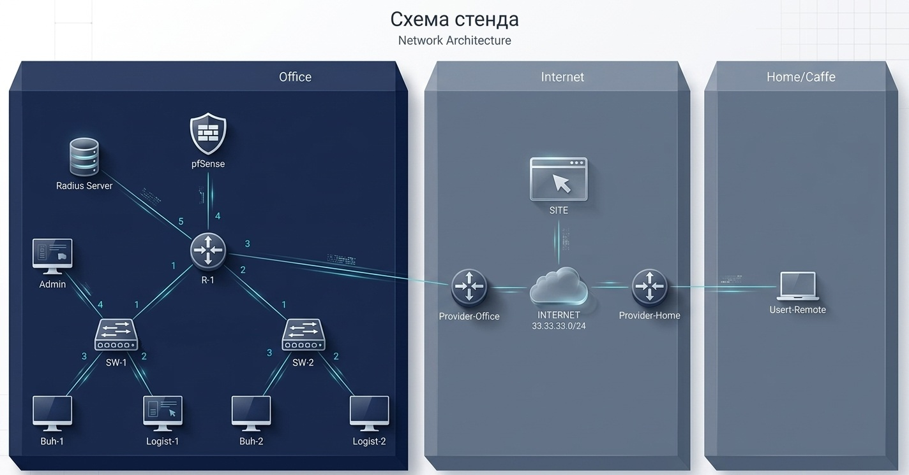
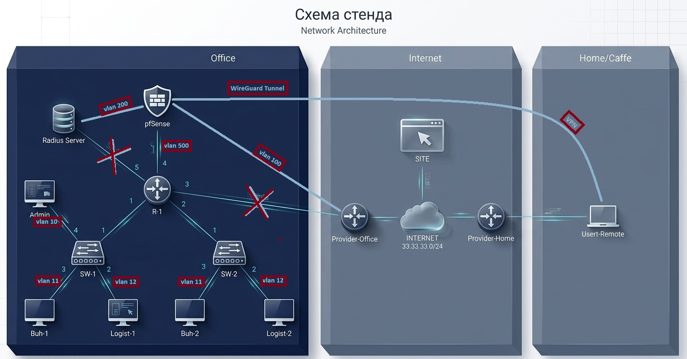

# HomeLab-Stand-Security
Virtual network security lab (vmware): VLANs, pfSense, Radius Server, Linux Server, Suricata IDS/IPS, VPN, DMZ.

Виртуальный стенд для отработки навыков сетевой безопасности.
Стенд развивался итерационно — от базовой сегментации 
до добавления DMZ, VPN и IDS/IPS.

## Топология

### Начальный стенд

### Финальный стенд

## Что реализовано

### Сетевая сегментация (MikroTik R-1)
- VLAN 10 — Admin (10.10.10.0/24)
- VLAN 11 — Buhgalteriya (10.10.11.0/24)
- VLAN 12 — Logistika (10.10.12.0/24)
- VLAN 77 — Management (172.16.0.0/24)
- VLAN 100 — Provider (65.10.10.0/29)
- VLAN 200 — DMZ (Radius Server)
- VLAN 500 — pfSense

L3-сегментация с ограничением доступа между VLAN 
через правила firewall.

### Межсетевой экран (pfSense)
- SNAT для выхода локальных порльзователей в интернет
- Port forwarding до внутренних сервисов,
  доступ по 80 порту к Apache на Server-е
- Правила фильтрации трафика между зонами
- Remote Access VPN — эмуляция подключения 
  удалённого сотрудника (Home/Caffe → Office)

### DMZ
- Server вынесен в изолированный сегмент (VLAN 200)
- Доступ из офисной сети ограничен правилами FW

### IDS/IPS (Suricata на pfSense)
- Развёртывание и настройка Suricata, 
- Тестирование обнаружения сканирования портов 
  через Nmap с удалённого хоста UserRemote
- Анализ алертов (срабатывание множества сигнатур)

### Аутентификация
- Развёртывание Radius Server (формально)
- Централизованная аутентификация пользователей

## Стек технологий
`pfSense` `MikroTik` `Suricata` `VPN` `VLAN` `RADIUS` `iptables`
